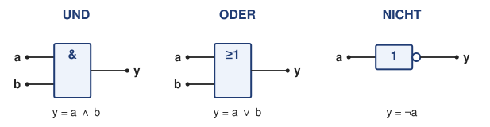
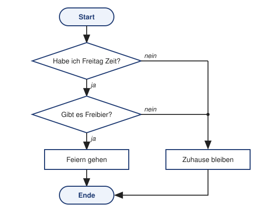

# Übung 00 – Logik im Alltag: Vom Satz zur booleschen Funktion

> **Info 1 · Übung 00** — Aufgabe: Logik im Alltag · Lösung: [Logik im Alltag](../Lösungen/00_Logik_im_Alltag_Lösung.md)

---

Ein Mikrocontroller kennt kein „Vielleicht“. Für ihn gibt es nur **1** (ja, wahr, an) und **0** (nein, falsch, aus). Trotzdem trifft er ziemlich clevere Entscheidungen, indem er einfache Ja/Nein-Bedingungen geschickt miteinander verknüpft.

Genau das machst du jeden Tag auch. In dieser Übung übersetzen wir ganz normale Sätze in **boolesche Funktionen**. Das ist die Grundlage für alles, was in den nächsten Wochen kommt: Schaltungen (Übung 01), Ablaufdiagramme (Übung 04) und `if`-Abfragen in C++.

---

## Teil A – So geht's: Vom Satz zur Funktion

Unser Beispiel:

> **„Wenn ich Freitag Zeit habe und es Freibier gibt, dann gehe ich feiern.“**

### Schritt 1 – Bedingungen und Ergebnis finden

Alles nach dem **„Wenn …“** sind Bedingungen, also die **Eingänge**. Alles nach dem **„dann …“** ist das Ergebnis, also der **Ausgang**. Jede Aussage bekommt einen kurzen Variablennamen:

| Rolle | Aussage | Variable |
|---|---|:-:|
| Eingang | Ich habe Freitag Zeit. | **Z** |
| Eingang | Es gibt Freibier. | **B** |
| Ausgang | Ich gehe feiern. | **F** |

Jede Variable kann nur **1** oder **0** sein: `Z = 1` heißt „ich habe Zeit“, `Z = 0` heißt „ich habe keine Zeit“.

### Schritt 2 – Die Verknüpfung erkennen

Bestimmte Wörter im Satz verraten dir, wie die Bedingungen zusammenhängen:

| Signalwort im Satz | Verknüpfung | Zeichen | FUB-Baustein | Bedeutung |
|---|---|:-:|:-:|---|
| „und“, „sowohl … als auch“ | **UND** | ∧ | `&` | nur 1, wenn **alle** Eingänge 1 sind |
| „oder“ | **ODER** | ∨ | `≥1` | 1, wenn **mindestens ein** Eingang 1 ist |
| „nicht“, „kein“, „ohne“ | **NICHT** | ¬ | `1` mit Kreis | dreht den Wert um: aus 1 wird 0, aus 0 wird 1 |

In unserem Satz steht „**und**“, also brauchen wir ein **UND**.

### Schritt 3 – Die Funktion aufschreiben

```
F = Z ∧ B
```

Gesprochen: „F ist Z und B“, also „Ich gehe feiern, wenn ich Zeit habe **und** es Freibier gibt.“

### Schritt 4 – Die Wahrheitstabelle

In der Wahrheitstabelle probieren wir **alle** Kombinationen der Eingänge durch. Bei 2 Eingängen sind das 2² = 4 Zeilen.

| Z | B | F = Z ∧ B | Was heißt das? |
|:-:|:-:|:-:|---|
| 0 | 0 | 0 | keine Zeit, kein Freibier → zu Hause |
| 0 | 1 | 0 | Freibier, aber keine Zeit → zu Hause |
| 1 | 0 | 0 | Zeit, aber kein Freibier → zu Hause |
| 1 | 1 | **1** | Zeit **und** Freibier → feiern! |

> **Tipp:** Bei *n* Eingängen hat die Tabelle 2ⁿ Zeilen. Damit du keine Kombination vergisst, zählst du die Eingänge einfach binär hoch: 00, 01, 10, 11.

### Schritt 5 – Zwei Bilder für dieselbe Logik

Logik kann man auch zeichnen. Wir schauen uns zwei Darstellungen an: den **FUB** und das **Ablaufdiagramm**.

**Die drei Grundbausteine im FUB** (Funktionsbausteinsprache, so wird z. B. auch eine SPS programmiert):



Die Signale fließen von **links** (Eingänge) nach **rechts** (Ausgang). Das Zeichen im Kasten sagt, was der Baustein macht. Der kleine Kreis am NICHT-Baustein bedeutet „umdrehen“ (negieren).

**Unser Satz als FUB:**


**Unser Satz als Ablaufdiagramm:**



Beide Bilder beschreiben **dieselbe** Entscheidung, nur aus einem anderen Blickwinkel:

- **FUB:** Alle Eingänge werden gleichzeitig verknüpft, so wie in einer Schaltung oder einer SPS.
- **Ablaufdiagramm:** Es wird Frage für Frage nacheinander geprüft, so wie in einem Programm. Die Raute ist eine Ja/Nein-Frage, der Kasten eine Aktion, die abgerundeten Felder sind Start und Ende.

Keine Sorge: Ablaufdiagramme schauen wir uns in Übung 04 noch genauer an. Hier geht es nur ums Prinzip.

> **Ausblick C++:** Genau so steht es später auch im Programm:
> ```cpp
> bool feiern = zeit && freibier;   // && = UND, || = ODER, ! = NICHT
> ```

---

## Teil B – Jetzt kommt der Regen

> **„Wenn ich Freitag Zeit habe und es Freibier gibt, dann gehe ich feiern. Wenn es aber Freitag ist und es regnet, dann gehe ich nicht feiern.“**

**Aufgabe 1 – Funktion aufstellen**

a) Welche neue Bedingung kommt dazu? Gib ihr einen Variablennamen.  
b) Welches Signalwort steckt im zweiten Satz? *(Tipp: „aber … nicht“)*  
c) Stelle **eine** Funktion F auf, die beide Sätze zusammen beschreibt.  
d) Fülle die Wahrheitstabelle aus. Wie viele Zeilen brauchst du jetzt?

| Z | B | R | F |
|:-:|:-:|:-:|:-:|
| 0 | 0 | 0 |   |
| 0 | 0 | 1 |   |
| 0 | 1 | 0 |   |
| 0 | 1 | 1 |   |
| 1 | 0 | 0 |   |
| 1 | 0 | 1 |   |
| 1 | 1 | 0 |   |
| 1 | 1 | 1 |   |

e) In wie vielen Fällen gehst du feiern?  
f) Zeichne die Funktion als FUB. Du brauchst einen UND-Baustein mit drei Eingängen und einen NICHT-Baustein.

**Aufgabe 2 – Ablaufdiagramm erweitern**

Erweitere das Ablaufdiagramm aus Teil A um die Frage nach dem Regen. Eine Skizze auf Papier reicht.  
*Achtung: Geht es bei der Regen-Frage bei „ja“ oder bei „nein“ weiter zum Feiern?*

---

## Teil C – Logik im Alltag

**Aufgabe 3 – Vom Satz zur Funktion**

Gehe bei jedem Satz so vor wie in Teil A:

1. Variablen festlegen (Eingänge und Ausgang)
2. Funktion aufschreiben
3. Wahrheitstabelle aufstellen
4. FUB skizzieren

a) **Flurlicht mit Bewegungsmelder:** „Das Licht im Flur geht an, wenn es dunkel ist und sich jemand bewegt.“  
b) **Regenschirm:** „Ich nehme den Regenschirm mit, wenn es regnet oder die Wetter-App Regen ansagt.“  
c) **Gurtwarner im Auto:** „Das Auto piept, wenn der Motor läuft und der Gurt nicht angelegt ist.“  
d) **Alarmanlage:** „Die Alarmanlage löst aus, wenn sie scharf geschaltet ist und ein Fenster oder die Tür offen ist.“  
   *Tipp: Was gehört hier zusammen? Setze Klammern!*

**Aufgabe 4 – Umgekehrt: Von der Funktion zum Satz**

Gegeben ist die Funktion:

```
Y = (A ∨ B) ∧ ¬C
```

Denk dir einen eigenen Alltagssatz aus, der genau diese Funktion beschreibt. Lege fest, wofür A, B, C und Y stehen, und prüfe deinen Satz mit einer Wahrheitstabelle.

**Denkfrage (Bonus) – Ist „oder“ immer ODER?**

Die Bedienung im Café fragt: „Möchtest du Tee oder Kaffee?“ Darfst du beides nehmen? Vergleiche mit Aufgabe 3b: Was ist der Unterschied?  
*(Mehr dazu in Übung 01 beim XOR.)*

---

Weiter geht's mit [Übung 01 – Boolesche Algebra & Grundschaltungen](../Aufgaben/01_Boolesche_Algebra.md). Zum Nachschlagen eignet sich das [Cheatsheet Boolesche Algebra](../Hilfsmittel/01_Cheatsheet_Boolesche_Algebra.md).
