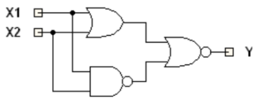
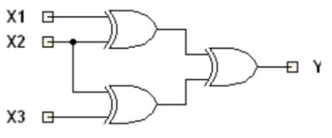
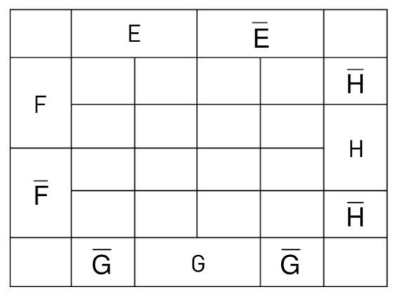
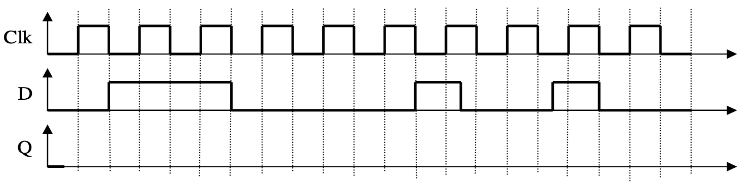
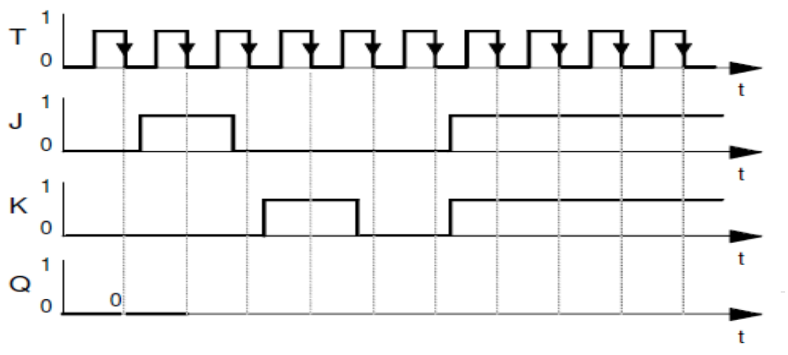

# Probeklausur – Grundlagen der Digitaltechnik

> **Info 1 · Übung 05** — Aufgabe: Probeklausur
>
> Quelle: [Original-PDF](../_Original/Probeklausur.pdf)

---

**Vorlesung:** Grundlagen der Digitaltechnik · **Studiengänge:** ASE (304032), MR (134033) · **Punkte:** 60 (Summe der Aufgaben 1–7) · **Bearbeitungszeit:** im Original nicht angegeben · **Einsatz:** Info 1, Übung 05

## Zu beachten

- Erlaubte Hilfsmittel sind:
  - 1 DIN-A4-Blatt beidseitig, ausschließlich von Hand beschrieben, als eigene Formelsammlung
  - Schreib- und Zeichenwerkzeug
  - Mit der Prüfung ausgehändigte Materialien
- Nicht erlaubt sind insbesondere:
  - Taschenrechner, Notebooks, Tablets, Smartphones
  - Verwendung weitere Materialien außer den oben genannten Hilfsmittel
- Stellen Sie Ihren Rechenweg nachvollziehbar dar. Hierfür gibt es Punkte!
- Ergebnisse ohne ersichtliche Herkunft werden nicht gewertet
- Geben Sie Ihre Lösung eindeutig an. Schreiben Sie ggf. einen Antwortsatz. Uneindeutige oder unleserliche Lösungen werden nicht bepunktet.
- Schreiben Sie auf jedes Blatt Ihren Namen und Ihre Matrikelnummer, schreiben Sie leserlich und nicht mit Bleistift oder in Rot
- Täuschungsversuche führen zum Ausschluss und Nichtbestehen der Klausur
- Rücktritt ist nach dem Austeilen dieser Aufgaben nicht mehr möglich

---

## Aufgabe 1 – Zahlensysteme (8 Punkte)

Gegeben sind folgende Zahlen in verschiedenen Zahlensystemen

1. 39₁₀
2. 14₁₆
3. 1101 0110₂

**a.** Geben Sie alle drei Zahlen in Binär-, im Dezimal- und im Hexadezimalsystem an (3 Punkte)

**b.** Addieren Sie 1. und 2. im Hexadezimalsystem (2 Punkte)

**c.** Subtrahieren Sie 2. von 3. im Binärsystem (2 Punkte)

**d.** Welcher Werteumfang (dezimal) kann mit positiven ganzzahligen 8-Bit Binärzahlen abgebildet werden? (1 Punkt)

---

## Aufgabe 2 – Bool’sche Algebra (6 Punkte)

Ermitteln Sie für diese Logik die Funktionstabelle. Bitte tragen Sie geeignete Zwischenergebnisse ein.

**a.**

**b.**

---

## Aufgabe 3 – Bool’sche Algebra (8 Punkte)

Vereinfachen Sie folgende Ausdrücke so dass diese Funktion mit minimalem Schaltungsaufwand aufgebaut werden kann.

**a.** $X1 \land (X1 \land 1)$

**b.** $X1 \lor (\overline{X2} \land \overline{X1 \lor \overline{X2} \lor X3})$

**c.** $\overline{\overline{X1} \land (\overline{X2} \lor \overline{X3})}$

---

## Aufgabe 4 – Schaltnetze (10 Punkte)

Gegeben ist die folgende Wahrheitstabelle.

| Fall | E | F | G | H | U |
|:----:|:-:|:-:|:-:|:-:|:-:|
| 1  | 0 | 0 | 0 | 0 | 1 |
| 2  | 0 | 0 | 0 | 1 | 1 |
| 3  | 0 | 0 | 1 | 0 | 1 |
| 4  | 0 | 0 | 1 | 1 | 1 |
| 5  | 0 | 1 | 0 | 0 | 0 |
| 6  | 0 | 1 | 0 | 1 | 0 |
| 7  | 0 | 1 | 1 | 0 | 1 |
| 8  | 0 | 1 | 1 | 1 | 1 |
| 9  | 1 | 0 | 0 | 0 | 1 |
| 10 | 1 | 0 | 0 | 1 | - |
| 11 | 1 | 0 | 1 | 0 | 1 |
| 12 | 1 | 0 | 1 | 1 | - |
| 13 | 1 | 1 | 0 | 0 | 1 |
| 14 | 1 | 1 | 0 | 1 | 0 |
| 15 | 1 | 1 | 1 | 0 | 1 |
| 16 | 1 | 1 | 1 | 1 | 0 |

Sie verknüpft die 4 Eingangsvariablen **E, F, G, H** mit der Ausgangsvariablen **U**. Die Fälle 10 und 12 treten nicht auf (don’t care).

**a.** Geben Sie die disjunktive oder konjunktive Normalform für U an (Tipp: Wählen Sie diejenige, deren Aufstellung weniger aufwändig ist) (4 Punkte)

**b.** Ermitteln Sie die vereinfachte Schaltfunktion für U mit Hilfe eines KV Diagramms und der Normalform aus **a)**. (6 Punkte)

**KV-Diagramm (Vorlage):**

|        | E | E | E̅ | E̅ |        |
|:------:|:-:|:-:|:-:|:-:|:------:|
| **F**  |   |   |   |   | **H̅** |
| **F**  |   |   |   |   | **H**  |
| **F̅** |   |   |   |   | **H**  |
| **F̅** |   |   |   |   | **H̅** |
|        | **G̅** | **G** | **G** | **G̅** |  |

---

## Aufgabe 5 – Speicherelemente (8 Punkte)

Ergänzen Sie folgende Impulsdiagramme

**a.** Für ein D-Latch FF (2 Punkte)

**b.** Für ein positive taktflanken-getriggertes D-FF (2 Punkte)

**c.** Für ein negativ taktflanken-getriggertes JK-FF (4 Punkte)

---

## Aufgabe 6 – Endliche Zustandsautomaten (10 Punkte)

Gegeben ist das Zustandsübergangsdiagramm.

**a.** Geben Sie an welchen Automatentyp Sie dafür wählen und begründen Sie Ihre Wahl (2 Punkte)

**b.** Im Diagramm ist ein Übergang mit „?“ eingezeichnet. Wie sind die Eingangsgrößen X₁X₀ für ein vollständiges und eindeutiges Schaltwerk zu wählen? (3 Punkte)

**c.** Füllen Sie die Zustandsübergangstabelle aus. (5 Punkte)

| Z₁(n) | Z₀(n) | X₁ | X₀ | Z₁(n+1) | Z₀(n+1) | Y₃ | Y₂ | Y₁ | Y₀ |
|:-----:|:-----:|:--:|:--:|:-------:|:-------:|:--:|:--:|:--:|:--:|
| 0 | 0 | 0 | 0 |   |   |   |   |   |   |
| 0 | 0 | 0 | 1 |   |   |   |   |   |   |
| 0 | 0 | 1 | 0 |   |   |   |   |   |   |
| 0 | 0 | 1 | 1 |   |   |   |   |   |   |
| 0 | 1 | 0 | 0 |   |   |   |   |   |   |
| 0 | 1 | 0 | 1 |   |   |   |   |   |   |
| 0 | 1 | 1 | 0 |   |   |   |   |   |   |
| 0 | 1 | 1 | 1 |   |   |   |   |   |   |
| 1 | 0 | 0 | 0 |   |   |   |   |   |   |
| 1 | 0 | 0 | 1 |   |   |   |   |   |   |
| 1 | 0 | 1 | 0 |   |   |   |   |   |   |
| 1 | 0 | 1 | 1 |   |   |   |   |   |   |
| 1 | 1 | 0 | 0 |   |   |   |   |   |   |
| 1 | 1 | 0 | 1 |   |   |   |   |   |   |
| 1 | 1 | 1 | 0 |   |   |   |   |   |   |
| 1 | 1 | 1 | 1 |   |   |   |   |   |   |

---

## Aufgabe 7 – Schaltwerke (10 Punkte)

Entwerfen Sie das Zustandsübergangsdiagramm einer Waschmaschine als Moore-Automat.

Die folgenden Punkte beschreiben die Funktionsweise:

- Im Programmablauf gibt die Eingangsvariable t an, ob zum nächsten Schritt gesprungen wird. (t=1 nächster Schritt, t=0 im aktuellen Schritt bleiben)
- Der Startzustand wird durch die Auswahl eins von zwei Programmen und t=1 verlassen.
- Im Programm p=0 werden die Schritte Vorwäsche, Hauptwäsche und Spülen ausgeführt.
- Im Programm p=1 werden nur die Schritte Hauptwäsche und Spülen ausgeführt.
- Falls während der Vorwäsche ein Programmwechsel gewünscht wird, muss trotzdem erst abgewartet werden, bis t=1 ist.
- Jeder Schritt kann durch einen asynchronen Reset wieder auf den Startzustand zurückgeführt werden.
- Im Programm Spülen soll der Weichspüler zugesetzt werden. Dazu muss der einzige Ausgabewert w=1 gesetzt werden
- Nach Beendigung des Spülens wird wieder der Startzustand eingenommen.

Stellen Sie Ihre binäre Zustandskodierung dar (z. B. 0000 = Startzustand)
