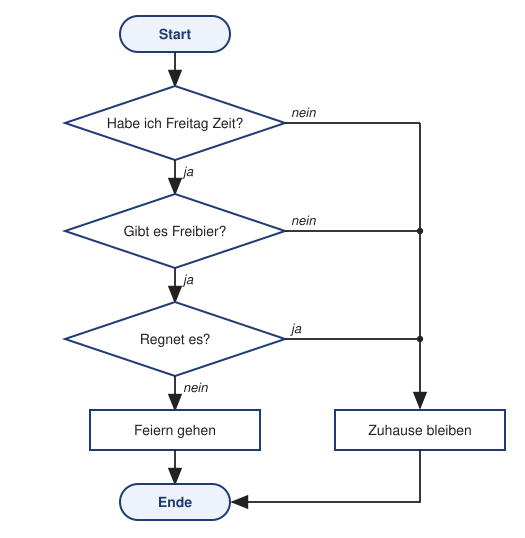
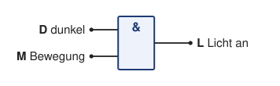
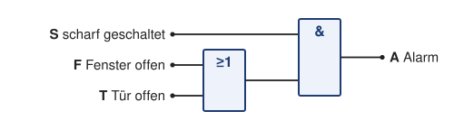

# Lösung Übung 00 – Logik im Alltag: Vom Satz zur booleschen Funktion

> **Info 1 · Übung 00** — Aufgabe: [Logik im Alltag](../Aufgaben/00_Logik_im_Alltag.md) · Lösung: Logik im Alltag

---

## Teil B – Jetzt kommt der Regen

### Aufgabe 1 – Funktion aufstellen

**a)** Neue Bedingung: „Es regnet.“ → Variable **R** (`R = 1` heißt „es regnet“).

| Rolle | Aussage | Variable |
|---|---|:-:|
| Eingang | Ich habe Freitag Zeit. | **Z** |
| Eingang | Es gibt Freibier. | **B** |
| Eingang | Es regnet. | **R** |
| Ausgang | Ich gehe feiern. | **F** |

**b)** Das Signalwort ist „**aber … nicht**“: Wenn es regnet, gehe ich **nicht** feiern. Damit ich feiern gehe, muss also zusätzlich gelten: Es regnet **nicht** → ¬R.  
„Wenn es Freitag ist“ ist keine neue Bedingung, denn es geht ohnehin um Freitag (steckt schon in Z).

**c)** Alle drei Bedingungen müssen gleichzeitig erfüllt sein:

```
F = Z ∧ B ∧ ¬R
```

Gesprochen: „Ich gehe feiern, wenn ich Zeit habe **und** es Freibier gibt **und** es **nicht** regnet.“

**d)** Mit 3 Eingängen braucht die Tabelle 2³ = **8 Zeilen**. Die Hilfsspalte ¬R macht das Ausfüllen leichter:

| Z | B | R | ¬R | F = Z ∧ B ∧ ¬R |
|:-:|:-:|:-:|:-:|:-:|
| 0 | 0 | 0 | 1 | 0 |
| 0 | 0 | 1 | 0 | 0 |
| 0 | 1 | 0 | 1 | 0 |
| 0 | 1 | 1 | 0 | 0 |
| 1 | 0 | 0 | 1 | 0 |
| 1 | 0 | 1 | 0 | 0 |
| 1 | 1 | 0 | 1 | **1** |
| 1 | 1 | 1 | 0 | 0 |

**e)** Nur in **einem** Fall: Ich habe Zeit, es gibt Freibier und es regnet nicht (Z = 1, B = 1, R = 0).

**f)** FUB:


> **Typische Fehler:**
> - `F = Z ∧ B ∧ R` – dann ginge man nur bei Regen feiern. Das „nicht“ fehlt.
> - `F = (Z ∧ B) ∨ ¬R` – dann ginge man auch ohne Zeit und ohne Freibier feiern, sobald es nicht regnet (prüfe Zeile 1 der Tabelle: Z = 0, B = 0, R = 0 ergäbe F = 1).

In C++ sähe das so aus:

```cpp
bool feiern = zeit && freibier && !regen;
```

### Aufgabe 2 – Ablaufdiagramm erweitern



Bei der Regen-Frage geht es bei „**nein**“ weiter zum Feiern, bei „ja“ bleibt man zu Hause. Die Reihenfolge der Fragen ist für das Ergebnis egal: Man könnte auch zuerst nach dem Regen fragen. Bei UND spielt die Reihenfolge keine Rolle (das ist das Kommutativgesetz aus Übung 01).

---

## Teil C – Logik im Alltag

### Aufgabe 3 – Vom Satz zur Funktion

#### a) Flurlicht mit Bewegungsmelder

**D** = es ist dunkel, **M** = jemand bewegt sich, **L** = Licht geht an

```
L = D ∧ M
```

| D | M | L = D ∧ M |
|:-:|:-:|:-:|
| 0 | 0 | 0 |
| 0 | 1 | 0 |
| 1 | 0 | 0 |
| 1 | 1 | **1** |



#### b) Regenschirm

**R** = es regnet, **W** = die Wetter-App sagt Regen an, **S** = Schirm mitnehmen

```
S = R ∨ W
```

| R | W | S = R ∨ W |
|:-:|:-:|:-:|
| 0 | 0 | 0 |
| 0 | 1 | **1** |
| 1 | 0 | **1** |
| 1 | 1 | **1** |


Wichtig: ODER ist auch dann 1, wenn **beide** Eingänge 1 sind. Wenn es regnet **und** die App Regen ansagt, nimmst du den Schirm natürlich auch mit.

#### c) Gurtwarner im Auto

**M** = Motor läuft, **G** = Gurt ist angelegt, **P** = Auto piept

```
P = M ∧ ¬G
```

| M | G | ¬G | P = M ∧ ¬G |
|:-:|:-:|:-:|:-:|
| 0 | 0 | 1 | 0 |
| 0 | 1 | 0 | 0 |
| 1 | 0 | 1 | **1** |
| 1 | 1 | 0 | 0 |


> **Hinweis:** Man kann die Variable auch anders festlegen, z. B. **O** = „Gurt ist offen“. Dann lautet die Funktion `P = M ∧ O` ohne NICHT. Beides ist richtig, entscheidend ist, dass die Festlegung der Variablen klar dazugeschrieben wird. Üblich ist es, Variablen „positiv“ zu benennen (angelegt, an, offen) und das „nicht“ mit ¬ auszudrücken.

#### d) Alarmanlage

**S** = Anlage ist scharf geschaltet, **F** = ein Fenster ist offen, **T** = die Tür ist offen, **A** = Alarm

```
A = S ∧ (F ∨ T)
```

| S | F | T | F ∨ T | A = S ∧ (F ∨ T) |
|:-:|:-:|:-:|:-:|:-:|
| 0 | 0 | 0 | 0 | 0 |
| 0 | 0 | 1 | 1 | 0 |
| 0 | 1 | 0 | 1 | 0 |
| 0 | 1 | 1 | 1 | 0 |
| 1 | 0 | 0 | 0 | 0 |
| 1 | 0 | 1 | 1 | **1** |
| 1 | 1 | 0 | 1 | **1** |
| 1 | 1 | 1 | 1 | **1** |



> **Warum die Klammern?** UND bindet stärker als ODER (wie „Punkt vor Strich“ in der Mathematik). Ohne Klammern würde `S ∧ F ∨ T` als `(S ∧ F) ∨ T` gelesen. Dann gäbe es Alarm, sobald die Tür aufgeht, auch wenn die Anlage **nicht** scharf ist. Du würdest also jedes Mal Alarm auslösen, wenn du nach Hause kommst.

### Aufgabe 4 – Von der Funktion zum Satz

Es gibt viele richtige Lösungen. Zwei Beispiele für `Y = (A ∨ B) ∧ ¬C`:

- **Alltag:** „Ich gehe joggen, wenn Wochenende ist **oder** ich Urlaub habe, **aber nicht**, wenn ich krank bin.“  
  A = Wochenende, B = Urlaub, C = krank, Y = joggen gehen
- **Technik:** „Der Lüfter läuft, wenn die Temperatur zu hoch ist **oder** der Taster gedrückt wird, **aber nicht**, wenn die Wartungsklappe offen ist.“  
  A = Temperatur zu hoch, B = Taster gedrückt, C = Klappe offen, Y = Lüfter an

| A | B | C | A ∨ B | ¬C | Y = (A ∨ B) ∧ ¬C |
|:-:|:-:|:-:|:-:|:-:|:-:|
| 0 | 0 | 0 | 0 | 1 | 0 |
| 0 | 0 | 1 | 0 | 0 | 0 |
| 0 | 1 | 0 | 1 | 1 | **1** |
| 0 | 1 | 1 | 1 | 0 | 0 |
| 1 | 0 | 0 | 1 | 1 | **1** |
| 1 | 0 | 1 | 1 | 0 | 0 |
| 1 | 1 | 0 | 1 | 1 | **1** |
| 1 | 1 | 1 | 1 | 0 | 0 |

Prüfe deinen eigenen Satz: Er muss in genau diesen drei Fällen „ja“ ergeben.

### Denkfrage (Bonus) – Ist „oder“ immer ODER?

Bei „Möchtest du Tee **oder** Kaffee?“ ist meistens „**entweder** Tee **oder** Kaffee“ gemeint, also genau eins von beiden und nicht beides. Das ist das **exklusive ODER (XOR, ⊕)**:

| T | K | Y = T ⊕ K |
|:-:|:-:|:-:|
| 0 | 0 | 0 |
| 0 | 1 | **1** |
| 1 | 0 | **1** |
| 1 | 1 | 0 |

Der Unterschied zu Aufgabe 3b liegt in der letzten Zeile: Beim Regenschirm (normales ODER) ist „beides“ erlaubt, bei Tee oder Kaffee (XOR) nicht. In der Informatik bedeutet „ODER“ ohne Zusatz immer das **normale (inklusive) ODER**. Das XOR lernst du in Übung 01 genauer kennen.
