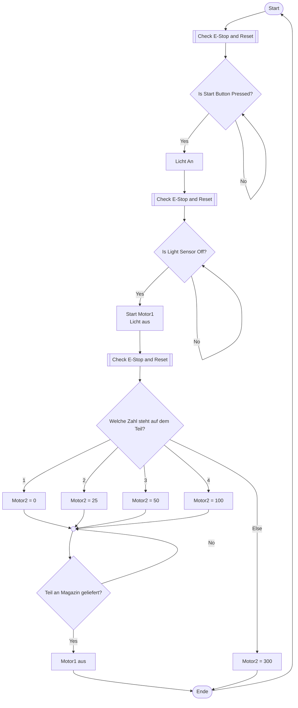
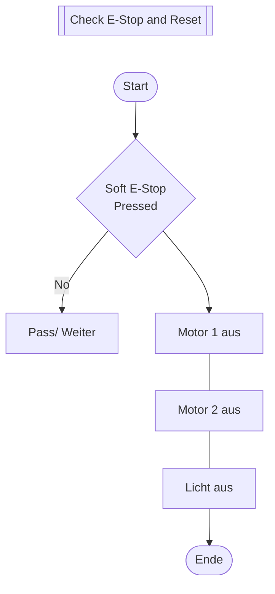

# Lösung Übung 04 – EVA, Struktogramm und PAP

> **Info 1 · Übung 04** — Aufgabe: [EVA, Struktogramm und PAP](../Aufgaben/04_EVA_Struktogramm_PAP.md) · Lösung: EVA, Struktogramm und PAP
>
> Quelle Diagramme: [Ablaufdiagram.drawio](../_Original/Ablaufdiagram.drawio) · [Struktogram.drawio](../_Original/Struktogram.drawio) · [Ablauf_Skizze.drawio](../_Original/Ablauf_Skizze.drawio)

---

## Aufgabe 1 – EVA und ADAM in der Informatik

**EVA-Prinzip:**
- **Eingabe – Verarbeitung – Ausgabe**
- Beschreibt den grundsätzlichen Ablauf in der Informatik:
  1. **Eingabe:** Daten oder Signale werden aufgenommen (z. B. durch Sensoren oder Benutzereingabe).  
  2. **Verarbeitung:** Die Daten werden durch das Programm oder System verarbeitet (z. B. Berechnungen, Steuerung).  
  3. **Ausgabe:** Ergebnisse werden ausgegeben (z. B. Anzeige, Aktor, Motor).  

**Beispiel:**  
Ein Lichtsensor misst Helligkeit (Eingabe), das Programm entscheidet, ob das Licht eingeschaltet werden soll (Verarbeitung), und schaltet dann eine Lampe an oder aus (Ausgabe).

**ADAM-Prinzip:**
- **Analysieren – Designen – Ausführen – Messen**
- Erweiterung des EVA-Prinzips für den Entwicklungsprozess:
  1. **Analysieren:** Problem und Anforderungen verstehen.  
  2. **Designen:** Lösung oder Algorithmus entwerfen.  
  3. **Ausführen:** Implementierung/Programmierung.  
  4. **Messen:** Überprüfen und bewerten des Ergebnisses.

---

## Aufgabe 2 – Struktogramm und Programmablaufplan (PAP)

Erstelle zu folgendem System (siehe Abbildung *04_Ablauf_Skizze.png*):


**Beschreibung:**
- Das System steuert zwei Motoren und eine Lampe.  
- Über den **Start-Button** (bool `Start`) wird der Ablauf aktiviert.  
- Der **Soft-E-Stop** (`Soft_E_Stop`) kann den Prozess jederzeit sicher anhalten.  
- Der **Lichtsensor** (`Lichtsensor`) erkennt, ob neues Teil vom Roboter angeliefert wurde.
- Der **Motor 1** treibt das Hauptförderband an.  
- Der **Motor 2** steuert die Auswurfrichtung (1–4) mit den Stufen `25`, `50` oder `100`.  
- Der **Roboterarm** legt die Objekte auf das Förderband.  

### Variablen – aus dem Labor (draw.io)

Auf Seite 2 von [Ablauf_Skizze.drawio](../_Original/Ablauf_Skizze.drawio) wurden im Labor die Elemente der Skizze mit Variablen belegt:

| Element in der Skizze | Variable (Startwert) |
|---|---|
| Start-Button | `bool Start = 0` |
| Soft E-Stop | `bool Soft_E_Stop = 0` |
| Lichtsensor (am Förderband) | `bool Lichtsensor = 0` |
| Lampe | `bool Licht = 0` |
| Motor 1 (Hauptförderband) | `bool Motor1 = 0` |
| Motor 2 (Auswurfrichtung) | `int Motor2 = 0` / `25` / `50` / `100` |

Die Werte von Motor 2 sind in der Skizze farblich den Ausgängen zugeordnet: Ausgang 1 → `0`, Ausgang 2 → `25`, Ausgang 3 → `50`, Ausgang 4 → `100`.

### Teil a) Struktogramm

#### Diagramm aus dem Labor (draw.io)

Rekonstruiert aus [Struktogram.drawio](../_Original/Struktogram.drawio) (Beschriftungen wie im Original):

```text
┌─ If Soft E Stop
│  Yes: (leer)
│  No:
│  ┌─ If Start Button
│  │  No:  pass
│  │  Yes: Licht an
│  │       ◁ Break if Stoft E-STOP = 0
│  │       ┌─ If( Lichtsensor <= 0
│  │       │  Yes: pass
│  │       │  No:  Motor1 on
│  │       │       ◁ Break if Stoft E-STOP = 0
│  │       │       ┌─ If uint8_t = X   (Fallunterscheidung)
│  │       │       │  1:    M2=0
│  │       │       │  2:    M2=0
│  │       │       │  3:    M2=0
│  │       │       │  4:    M2=0
│  │       │       │  Else: M2=?
│  │       │       └─
│  │       └─
│  └─
└─
```

Legende: `┌─ … └─` = Verzweigung bzw. Fallunterscheidung mit Bedingung, `Yes:`/`No:`/`1:` … = Zweige (im Original von links nach rechts), `◁` = Abbruch-Block (rot, „Break“).

Hinweise zur Rekonstruktion:
- Im Original liegen die folgenden Blöcke jeweils unter dem breiten Zweig (`No` bei *Soft E Stop*, `Yes` bei *Start Button*, `No` bei *Lichtsensor*); der schmale Zweig enthält nur `pass` bzw. nichts. Deshalb sind sie hier dort eingerückt.
- Die beiden roten „Break“-Blöcke reichen im Original über die gesamte Breite des Diagramms.
- Außerdem enthält die Datei eine kleine Legende („Bedingung“, „Anweisung“) und ein einzelnes, nicht eingebundenes Element „If Lichtsensor“ neben dem Diagramm.

### Teil b) Programmablaufplan (PAP)

#### Diagramm aus dem Labor (draw.io)

Rekonstruiert aus [Ablaufdiagram.drawio](../_Original/Ablaufdiagram.drawio). Die Datei enthält zwei Teildiagramme: den Hauptablauf und das Unterprogramm „Check E-Stop and Reset“, das im Hauptablauf vor jeder Abfrage aufgerufen wird.

**Hauptablauf**



**Unterprogramm „Check E-Stop and Reset“**



Hinweise zur Rekonstruktion:
- `[[…]]` = Unterprogramm (Process-Symbol im Original).
- Die `No`-Pfeile von „Is Start Button Pressed?“ und „Is Light Sensor Off?“ enden im Original auf der Verbindungslinie direkt vor der jeweiligen Raute (Warteschleife); der `No`-Pfeil von „Teil an Magazin geliefert?“ endet am Sammelpunkt oberhalb der Raute.
- „Ende“ ist im Original mit einem Pfeil zurück auf „Start“ verbunden (Endlosschleife).
- Der Pfeil von „Soft E-Stop Pressed“ zu „Motor 1 aus“ ist im Original unbeschriftet.
- „Motor2 = 300“ (Zweig `Else`) gehört zur erweiterten Skizze auf Seite 3 von [Ablauf_Skizze.drawio](../_Original/Ablauf_Skizze.drawio); dort sind zusätzlich `int Motor2 = 300`, `int part_type = x`, `bool Lichtsensor 2 = 0` und `bool Licht2 = 0` eingezeichnet.

---

💡 **Hinweis:**  
Ein echter **Not-Aus** darf niemals softwarebasiert sein. Der *Soft_E_Stop* dient nur als logische Simulation.
