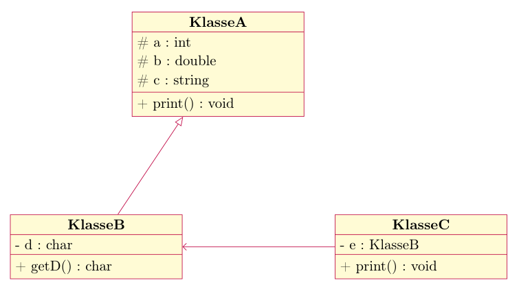
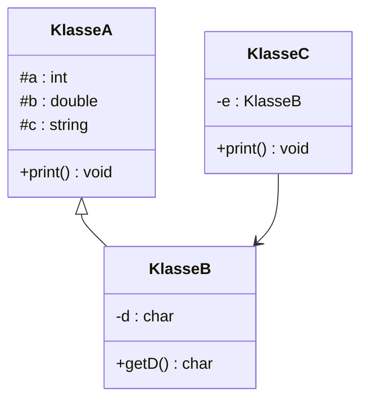

# Übung 03.1 – Vererbung

> **Info 2 · Übung 03.1** — Aufgabe: Vererbung, [Vererbung & Polymorphie (Übung 03.0)](../Aufgaben/03_00_Vererbung_Polymorphie.md) · Lösung: [OOP-Beispielprojekt](../Lösungen/03_OOP_Beispielprojekt.md) · Hilfsmittel: [Visual Studio Tipps und Doxygen](../Hilfsmittel/03_Visual_Studio_Tipps_und_Doxygen.md)
>
> Quelle: [Original-PDF](../_Original/03_01_Aufgaben_Vererbung.pdf)

---

| Veranstaltung | Blatt (laut Original) | Umfang |
|---|---|---|
| Informatik 2 (304033) | Übungsblatt #2 | 5 Seiten, Aufgaben 1–3 |

## Aufgabe 1

Analysieren Sie folgende Klassen:

```cpp
 1  #ifndef PERSON_H_
 2  #define PERSON_H_
 3
 4  #include <iostream>
 5  #include <string>
 6
 7  class Person {
 8  public:
 9      Person(std::string vorname, std::string nachname) {
10          this->vorname = vorname;
11          this->nachname = nachname;
12      }
13
14      const std::string& getNachname() {
15          return nachname;
16      }
17
18      void setNachname(const std::string& nachname) {
19          this->nachname = nachname;
20      }
21
22      const std::string& getVorname() {
23          return vorname;
24      }
25
26      void setVorname(const std::string& vorname) {
27          this->vorname = vorname;
28      }
29
30      virtual void print() {
31          std::cout << "Name: " << vorname << " " << nachname << "\n";
32      }
33
34      virtual ~Person() = default;
35  protected:
36      std::string vorname;
37      std::string nachname;
38  };
39
40  #endif
```

```cpp
 1  #ifndef STUDENT_H_
 2  #define STUDENT_H_
 3
 4  #include <iostream>
 5  #include <string>
 6
 7  #include "Person.h"
 8
 9  class Student : public Person {
10  public:
11      Student(std::string vorname, std::string nachname, int matrNr,
12          std::string studiengang) : Person(vorname, nachname) {
13          this->matrNr = matrNr;
14          this->studiengang = studiengang;
15      }
16
17      int getMatrNr() {
18          return matrNr;
19      }
20
21      void setMatrNr(int matrNr) {
22          this->matrNr = matrNr;
23      }
24
25      const std::string& getStudiengang() {
26          return studiengang;
27      }
28
29      void setStudiengang(const std::string& studiengang) {
30          this->studiengang = studiengang;
31      }
32
33      void print() override {
34          Person::print();
35          std::cout << "Studiengang: " << studiengang
36              << ", Matrikelnummer: " << matrNr << "\n";
37      }
38
39  private:
40      int matrNr;
41      std::string studiengang;
42  };
43
44  #endif
```

```cpp
 1  #ifndef PROFESSOR_H_
 2  #define PROFESSOR_H_
 3
 4  #include <iostream>
 5  #include <string>
 6
 7  #include "Person.h"
 8
 9  class Professor : public Person {
10  public:
11      Professor(std::string vorname, std::string nachname,
12          std::string fakultaet, std::string tel) : Person(vorname, nachname) {
13          this->fakultaet = fakultaet;
14          this->tel = tel;
15      }
16
17      const std::string& getFakultaet() {
18          return fakultaet;
19      }
20
21      void setFakultaet(const std::string& fakultaet) {
22          this->fakultaet = fakultaet;
23      }
24
25      const std::string& getTel() {
26          return tel;
27      }
28
29      void setTel(const std::string& tel) {
30          this->tel = tel;
31      }
32
33      void print() override {
34          Person::print();
35          std::cout << "Fakultät: " << fakultaet
36              << ", Telefon: " << tel << "\n";
37      }
38
39  private:
40      std::string fakultaet;
41      std::string tel;
42  };
43
44  #endif
```

- Kreuzen Sie alle wahren Aussagen an:
  - Die Klasse `Student` erbt von Klasse `Person`.
  - Die Klasse `Professor` erbt von Klasse `Person`.
  - Die Klasse `Student` erbt von Klasse `Professor`.
  - Die Klasse `Person` erbt von Klasse `Student`.
- Innerhalb welcher Klassen sind die beiden Attribute `vorname` und `nachname` der Klasse `Person` sichtbar?
- Wie viele geerbte Attribute besitzt die Klasse `Professor`?
- Implementieren Sie auf Papier:
  - Instanziieren Sie jeweils ein Objekt der Klasse `Person`, `Student` und `Professor`.
  - Lassen Sie sich die Daten der drei Objekte mit Hilfe der entsprechenden `print`-Methoden ausgeben.

## Aufgabe 2

Implementieren Sie folgende Klassen, welche für eine Banksoftware genutzt werden sollen:

- Klasse `Konto`:
  - Attribute:
    - Kontoinhaber (String)
    - Kontonummer (String)
    - Kontostand (Kommazahl)
  - Methoden:
    - Konstruktor (Initialisierung aller Attribute)
    - Einzahlen (Erhöht den Kontostand um den übergebenen Betrag)
    - Auszahlen (Verringert den Kontostand um den übergebenen Betrag)
    - Kontoauszug (Gibt den aktuellen Kontostand auf der Konsole aus)
- Klasse `Sparkonto`, welche von `Konto` erbt:
  - Zusätzliche Attribute:
    - Zinssatz (Kommazahl)
  - Zusätzliche Methoden:
    - Jahresabschluss (Erhöht den Kontostand um die Zinsen)
  - Zu überschreibende Methoden:
    - Konstruktor (Initialisierung aller Attribute)
    - Auszahlen (Auszahlung erfolgt nur, wenn Kontostand nicht ins Minus gerät, ansonsten Warnmeldung)
- Klasse `Girokonto`, welche von `Konto` erbt:
  - Zusätzliche Attribute:
    - Kreditrahmen (Kommazahl)
    - Sollzinssatz (Kommazahl)
    - Habenzinssatz (Kommazahl)
    - Bearbeitungsgebühr (Kommazahl)
  - Zusätzliche Methoden:
    - Jahresabschluss (Erhöht bzw. verringert den Kontostand um die Zinsen (Soll-/Habenzinsen))
  - Zu überschreibende Methoden:
    - Konstruktor (Initialisierung aller Attribute)
    - Auszahlen (Auszahlung erfolgt nur, wenn Kontostand nicht den Kreditrahmen unterschreitet, ansonsten Warnmeldung; Abzug der Bearbeitungsgebühr)
    - Einzahlen (Abzug der Bearbeitungsgebühr)
- Zeichnen Sie ein UML-Klassendiagramm, welches alle drei Klassen beinhaltet.

## Aufgabe 3

Gegeben sei folgendes UML-Klassendiagramm:



_Dasselbe Diagramm als Mermaid-Nachbau:_



> **Hinweise (Kommentare im Original-PDF zum Diagramm):**
> - `+` public, `#` protected, `-` private
> - Klasse B erbt von Klasse A.
> - Klasse C greift auf Klasse B zu.
> - Mittleres Fach einer Klasse: „Attribute“, unteres Fach: „Methoden“

Implementieren Sie die Klassen.
