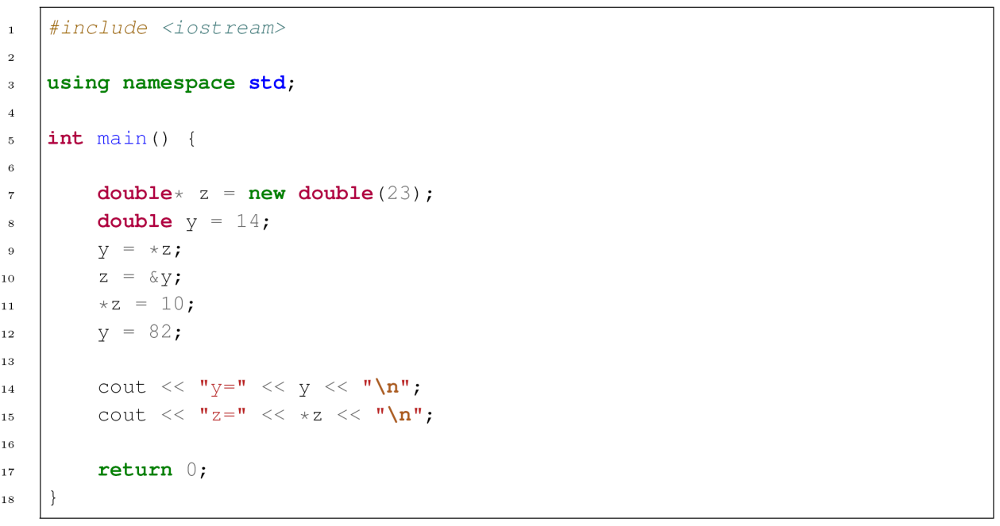

# Übung 04.0 – Dynamische Speicherverwaltung

> **Info 2 · Übung 04.0** — Aufgabe: Dynamische Speicherverwaltung, [Pointer (Übung 04.1)](../Aufgaben/04_01_Pointer.md) · Lösung: [Pointer (Übung 04.1)](../Lösungen/04_01_Pointer_Lösung.md) · Hilfsmittel: [Recap Pointer und Speicherverwaltung](../Hilfsmittel/04_Recap_Pointer_und_Speicherverwaltung.md)
>
> Quelle: [Original-PDF](../_Original/04_Dyn_Speicherverwaltung.pdf)

---

| Veranstaltung | Semester | Blatt | Dozent |
|---|---|---|---|
| Labor Informatik 2 | WS2526 | Übungsblatt 4 – Dynamische Speicherverwaltung | M. Eng. Pascal Keller |

## Aufgabe 1: Codeanalyse

Analysieren Sie folgenden Code:

```cpp
 1  #include <iostream>
 2
 3  using namespace std;
 4
 5  int main() {
 6
 7      double* z = new double(23);
 8      double y = 14;
 9      y = *z;
10      z = &y;
11      *z = 10;
12      y = 82;
13
14      cout << "y=" << y << "\n";
15      cout << "z=" << *z << "\n";
16
17      return 0;
18  }
```

<details>
<summary>Original-Screenshot</summary>



</details>

**Fragestellungen:**

- Was steht am Ende in der Konsole?
- Erklären Sie für die Zeilen 9-12, was in der jeweiligen Zeile passiert.
- Was wurde im obigen Quellcode vergessen?

## Aufgabe 2: Dynamische Datenspeicherung

### 2.1. Anlegen des Arrays

Lesen Sie über die Konsole einen Datentyp und eine Anzahl `n` ein. Folgende Datentypen sollen zur Auswahl stehen: `char`, `int` und `double`

Legen Sie anschließend dynamisch ein Array der Länge `n` mit dem gewählten Datentyp an.

### 2.2 Ein- und Ausgabe der Daten

Lesen Sie anschließend `n` Datensätze des oben ausgewählten Datentyps ein und speichern Sie die Daten in dem dynamisch angelegten Array. Geben Sie nach der erfolgreichen Eingabe die Daten in der Reihenfolge, in der sie eingegeben wurden, auf der Konsole aus. Anschließend beginnt das Programm von vorne und der Nutzer wird erneut aufgefordert, einen neuen Datentyp und eine neue Anzahl einzugeben.

**Hinweise:**

- Um das dynamisch erzeugte Array zu speichern, muss ein dazu passender Pointer angelegt werden. Legen Sie für jeden Datentyp einen entsprechenden Pointer an (`char*`, `int*` und `double*`).
- Überprüfen Sie sowohl bei der Eingabe des Datentyps als auch bei der Eingabe der Daten, ob eine korrekte Eingabe durchgeführt wurde. Nutzen Sie hierzu die bereits bekannte Funktion `cin.clear()`.
- Vergessen Sie nicht, nach jedem Programmdurchlauf die Arraydaten zu löschen und den verwendeten Pointer wieder als `nullptr` zurückzusetzen.

### Bonus

Verwenden Sie nur einen einzigen Pointer, der je nach Anwendungsfall Arrays aller Datentypen aufnehmen kann. Nutzen Sie hierzu einen Universalpointer des Typs `void*`. Ein solcher Pointer kann nicht direkt dereferenziert werden, da der Typ der dort gespeicherten Daten dem System nicht bekannt ist. Bei der Verwendung des Arrays muss deshalb dieser Pointer zuerst durch eine explizite Typumwandlung (type cast) in den korrekten Pointertyp umgewandelt werden.

Beispiel:

| Nutzung `int`-Pointer mit `int`-Daten: | Nutzung Universalpointer mit `int`-Daten: |
|---|---|
| `cout << intArray[i];` | `cout << ((int*)uniArray)[i];` |
