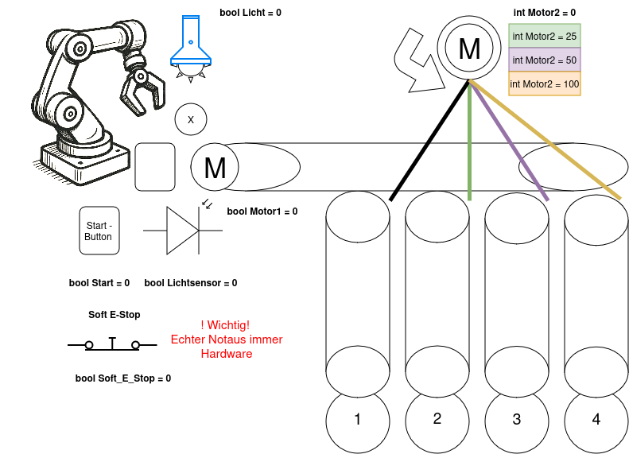

# Übungsblatt 4

## Aufgabe 1 – EVA und ADAM in der Informatik
Beschreibt den grundsätzlichen Ablauf in der Informatik:

**EVA-Prinzip:**
- **Eingabe – Verarbeitung – Ausgabe**

**ADAM-Prinzip:**
- **Analysieren – Designen – Ausführen – Messen**

---

## Aufgabe 2 – Struktogramm und Programmablaufplan (PAP)

Erstelle zu folgendem System (siehe Abbildung *Ablauf_Skizze.png*):

**Beschreibung:**
- Das System steuert zwei Motoren und eine Lampe.  
- Über den **Start-Button** (bool `Start`) wird der Ablauf aktiviert.  
- Der **Soft-E-Stop** (`Soft_E_Stop`) kann den Prozess jederzeit sicher anhalten.  
- Der **Lichtsensor** (`Lichtsensor`) erkennt, ob neues Teil vom Roboter angeliefert wurde.
- Der **Motor 1** treibt das Hauptförderband an.  
- Der **Motor 2** steuert die Auswurfrichtung (1–4) mit den Stufen `25`, `50` oder `100`.  
- Der **Roboterarm** legt die Objekte auf das Förderband.  

### Teil a) Struktogramm

### Teil b) Programmablaufplan (PAP)
  

---

💡 **Hinweis:**  
Ein echter **Not-Aus** darf niemals softwarebasiert sein. Der *Soft_E_Stop* dient nur als logische Simulation.
